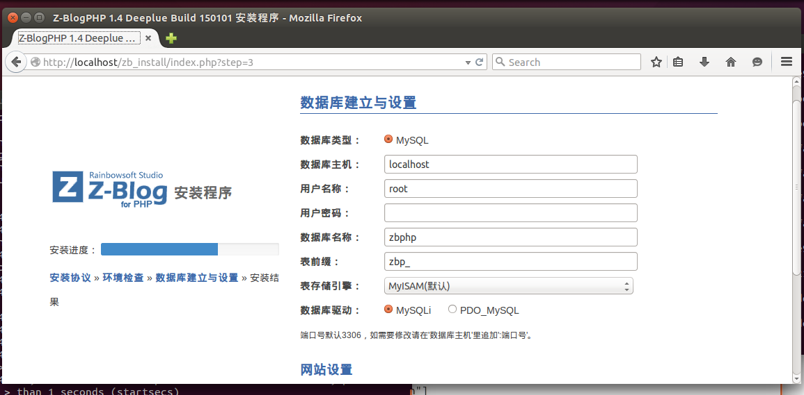

#zblogphp-docker
---
基于Z-BlogPHP在线安装程序构建

## 部署方式

### 非云服务
1. [安装Docker](http://yeasy.gitbooks.io/docker_practice/content/install/index.html)。

## 程序安装说明
1. Docker启动后，直接打开http://localhost
2. 数据库主机``localhost``，用户名``root``，密码空，数据库名``zbphp``，其他任意。如图：

3. 安装完成，尽情享受吧！

